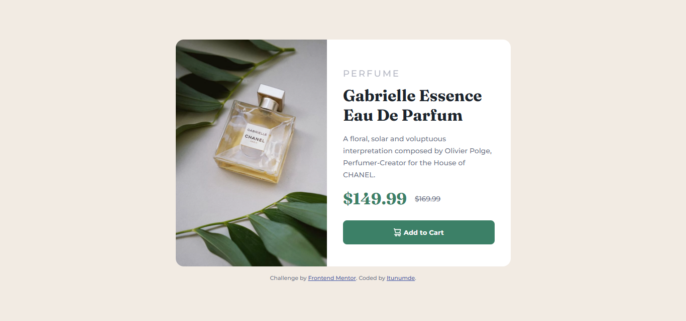

# Frontend Mentor - Product preview card component solution

This is my solution to the Product preview card component challenge on Frontend Mentor. This project helped me practice semantic HTML, Flexbox layout, custom properties, and a mobile-first responsive design approach.

## Table of contents

- [Overview](#overview)
  - [The challenge](#the-challenge)
  - [Screenshot](#screenshot)
  - [Links](#links)
- [My process](#my-process)
  - [Built with](#built-with)
  - [What I learned](#what-i-learned)
  - [Continued development](#continued-development)
  - [Useful resources](#useful-resources)
- [Author](#author)
- [Acknowledgments](#acknowledgments)

**Note: Delete this note and update the table of contents based on what sections you keep.**

## Overview

### The challenge

Users should be able to:

- View the optimal layout depending on their device's screen size
- See hover and focus states for interactive elements

### Screenshot



### Links

- Solution URL: [Add solution URL here](https://github.com/itunumide/product-preview-card)
- Live Site URL: [Add live site URL here](https://product-preview-card-pi-mocha.vercel.app/)

## My process

### Built with

- Semantic HTML5 markup
- CSS custom properties
- Flexbox
- CSS Media queries
- Mobile-first workflow

**Note: These are just examples. Delete this note and replace the list above with your own choices**

### What I learned

This challenge helped me apply a mobile-first approach using media queries. I also learned how to:

- Use Flexbox to evenly divide space between components
- Swap images for different screen sizes using display: none/block
- Implement consistent spacing and typography with CSS variables
  To see how you can add code snippets, see below:

```html
<section class="product-card__image-section">
  
  
</section>
```

```css
@media (min-width: 650px) {
  .product-card {
    display: flex;
    width: 50%;
  }
  .product-card__image {
    display: none;
  }
  .product-card__image__desktop {
    display: block;
  }
}
```

### Continued development

I'd like to:
 - Improve my responsiveness skills with CSS Grid for more complex layouts
 - Explore the use of picture tag for image optimization
 - Practice more on accessibility improvements


### Useful resources

- CSS-Tricks: Flexbox
- Frontend Mentor community

## Author

- Website - [Add your name here](https://itunu-i-raji.vercel.app)
- Frontend Mentor - [@yourusername](https://www.frontendmentor.io/profile/ITUNUMIDE)
- Twitter - [@yourusername](https://www.twitter.com/ITUNUMIDE)


## Acknowledgments

I will like to thank the Frontend Mentor community for the feedback, support, and resources shared. Special thanks to Frontend Mentor for consistently providing high-quality, real-world challenges that help improve my HTML and CSS skills.

Additionally, I referenced solutions and discussions on the Frontend Mentor Discord and forums to better understand best practices and approaches to responsive design.
```
